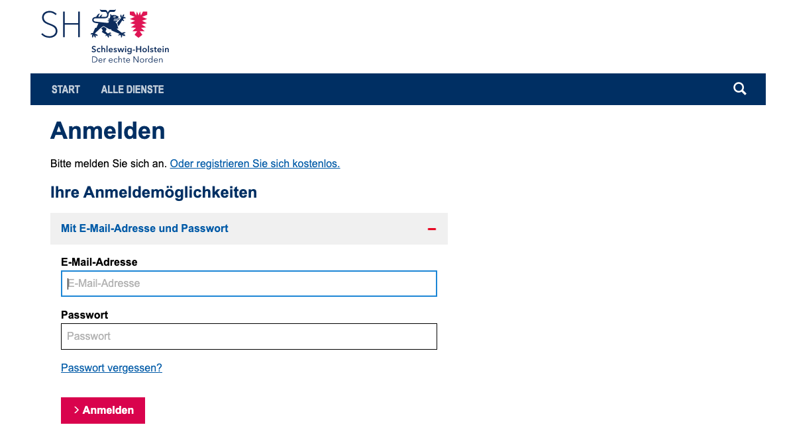
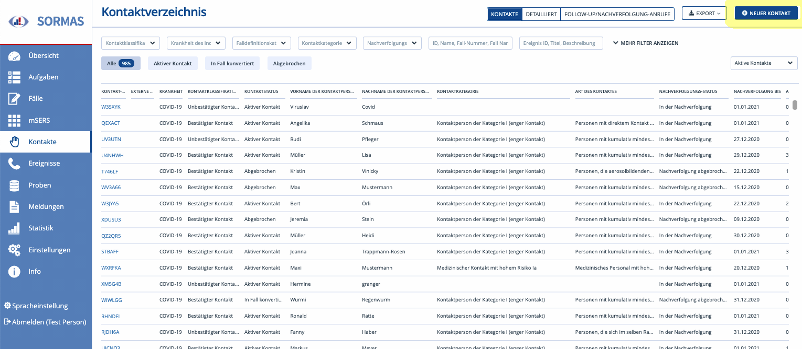
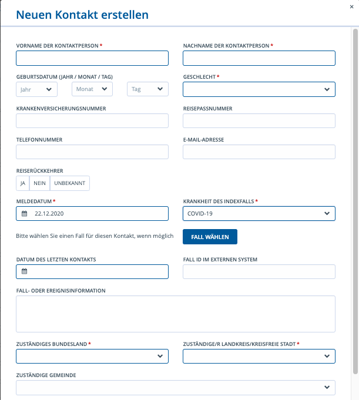
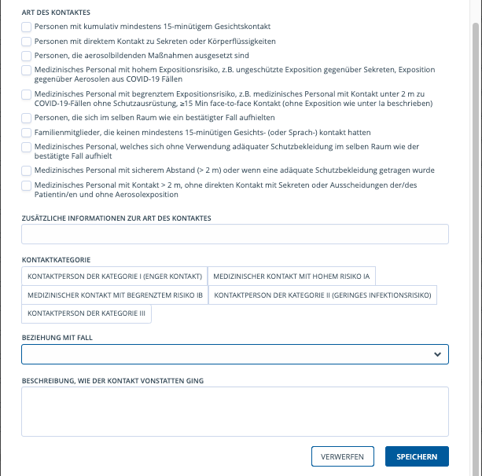

SOR01. Neuer Fall/Neuer Kontakt anlegen

## Abstract

Der Arbeitsprozess kann an unterschiedlichen Punkten starten,

1.) durch eine **Labor-(Arzt)meldung** via DEMIS/SurvNet/Email,

2.) Anruf in der **Hotline**, z.B. bei einer Anfrage einer potentiellen oder
tatsächlichen Kontaktperson bzw. eines positiv getesteten Falles, wenn z.B.
weitere Angeben zum Fall gemacht werden oder Kontaktperson nun Covid-Symptome
entwickelt (Fälle genauer spezifizieren). Hier wird dazu jede Anfrage in SORMAS
aufgenommen, in einem zweiten Schritt (Ermittlern, Spezi-Team) validiert und
dann ggf. weitere Schritte (Ermittlung, Rückruf, …) eingeleitet.

## 1.) Labor-(Arzt)meldung

Wird dem Gesundheitsamt das Laborergebnis eines Abstrichs gemeldet, muss im
ersten Schritt ein Fall angelegt werden.

Das Laborergebnis trifft per DEMIS, SurvNet oder Email ein. Die Eingänge werden
von dem Team Verwaltung (Personen) bearbeitet und entsprechend in SORMAS
angelegt.

Hier schließen sich folgende Schritte an:

### Prüfen Kontaktperson oder verdachts, bzw. bestätigter Fall 

Dazu wird geprüft, ob die Person, egal ob Kontakt oder Fall, bereits in der
Datenbank vorhanden ist. Mit dem Vornamen, Namen und/oder Geburtsdatum kann nun
in „Fälle“ und „Kontakte“ geprüft werden ob die Person bereits in der Datenbank
vorhanden ist.

**!! Prüfen: Ist die Person als Fall bei uns bekannt?**

\- Im linken blauen Menü auf „*Fälle*“

\- Namen in Suchfeld „*ID, Name, Epid-Nr. …*“ eintragen (oben mittig)

\- Wenn Treffer \>\> Doppelung prüfen, eventuell Daten aktualisieren

\- Wenn kein Treffer \>\> **Neuen Fall anlegen**  

**!! Prüfen: Ist die Person als Kontakt bei uns bekannt?**

\- In SORMAS im linken blauen Menü auf „*Kontakte*“

\- Name in Suchfeld „*ID, Name, Epid-Nr. …*“ eintragen (oben mittig)

Wenn KEIN Treffer \>\> **Neuen Fall anlegen**

Wenn Treffer \>\> weiter zu **Kontakt zu Fall konvertieren**

\- **Wenn weder als Kontakt, noch als Fall in SORMAS hinterlegt, wie folgt
verfahren:** 

In SORMAS im linken blauen Menü auf „*Fälle*“

Oben rechts auf „*NEUER FALL*“ klicken

\- **Das Fenster: „Neuen Fall erstellen“** öffnet sich

Im Feld „*Meldedatum*“ eintragen: **Eingangsdatum** im Gesundheitsamt
Nordfriesland (z.B. wenn Laborbefund gefaxt, dann Datum, an dem das Fax
eingegangen ist – NICHT Befunddatum, das im Laborbefund steht)  

Sollte die Person bereits als Fall oder Kontakt vorhanden sein, dann werden in
dem bestehenden Datensatz des Falles oder Kontaktes die neuen Informationen
eingetragen. Sollte unklar sein, ob diese Informationen relevant sind oder wenn
kein Eingabefeld dafür vorgesehen ist, können diese unter „Allgemeiner
Kommentar“ eingetragen werden.

### Neuen Fall anlegen

Wenn die Person, die dem Gesundheitsamt gemeldet wird, nicht unter „Fälle“
gefunden, dann kann durch anklicken von "neuer Fall" (rechts oben) alle
Informationen zu dem Fall angelegt werden.

#### Meldeaddress prüfen

Im ersten Schritt wird die Meldeaddress geprüft. Dieses geschieht über das
Einwohnermelderegister der Behördenauskunft für öffentliche Stellen unter der
Webseite:
[https://servicekonto.serviceportal.schleswig-holstein.de/Servicekonto/Profile/Profile/ShowOverview](https://servicekonto.serviceportal.schleswig-holstein.de/Servicekonto/Profile/Profile/ShowOverview%20)

Foto 1

In der Behördenauskunft wird unter Angabe des Bundeslandes, Landkreis, Vorname,
Nachname, ggf Geburtsdatum geprüft ob die im Labormeldebogen angegebene
Anschrift mit der im Melderegister übereinstimmt.

In SORMAS wird NUR die Meldeaddresse hinterlegt unter der die Person offiziell
gemeldet ist.

Wenn die Meldeaddresse verifiziert ist wird der neue Fall erstellt in dem der
Button oben rechts angeklickt wird.

Foto 2

Daraufhin öffnet sich das Untermenü "**Neuen Fall erstellen**".

Foto 3

In die Eingabemaske werden möglichst viele Stammdaten eingetragen. Bei den mit
„\*“ gekennzeichnet Feldern handelt es sich um Pflichtfelder die ausgefüllt
werden müssen. Dazu gehören:

-   "**Fall-Ursprung**", auswählen zwischen "Im Land" bzw. "Einreiseort";

-   "**Meldedatum**", an welchem Datum der Fall dem Gesundheitsamt gemeldet
    wurde

-   "**Krankheit**" , hier ist voreingestellt: COVID-19

-   "**zuständiges Bundesland**" (voreingestellt: Schleswig-Holstein),

-   "**zuständiger Landkreis/kreisfreie Stadt**" (voreingestellt:
    Nordfriesland),

-   aus Auswahl des "**Aufenthaltsort**" zwischen "Einrichtung" bzw. "Zuhause" -
    wenn hier "Einrichtung" ausgewählt wird erscheint ein Untermenue in dem dann
    entsprechend "**Einrichtungskategorie**", "**Art der Einrichtung**" und Name
    der "**Einrichtung**" ausgewählt werden muss. Im Feld Gesundheitseinrichtung
    muss, soweit nichts anderes bekannt, „Zuhause oder anderer Ort“ eingetragen.

-   "**Vorname**"

-   "**Nachname**"

-   "**Geschlecht**"

-   WICHTIG ist immer auch "**Telefonnummer**" und "**E-Mail-Addresse**"
    anzugeben (Die EMail-Adresse sollte immer mit aufgenommen werden,
    insbesondere wenn Anrufer damit einverstanden ist, per EMail kontaktiert zu
    werden.)

-   zur besseren Zuordnung bitte auch immer noch das "**Geburtsdatum**" angeben.

#### Nächster Schritt: "Neue Probe erstellen"

Als nächster Arbeitsschritt muss zusätzlich noch unter eine "Neue Probe
erstellen" angeklickt und entspreched ausgefüllt werden. (Erläuterung dazu unter
dem **Kapitel: Neue Probe** erstellen)

## 2.) Hotline

### Prüfen Kontaktperson, bzw Verdachtsfall, bzw. bestätigter Fall 

Zuerst muss von der Hotline telefosch werden, ob es sich um eine Kontaktperson
oder um einen Fall (z.B. Verdachts-, bestätigter Fall) handelt um den
entsprechenden Menüpunkt auf der Startseite auszuwählen.

Dazu muss die anrufenden Person entsprechend gefragt werden:

>   1. "*Rufen Sie an um dem Gesundheitsamt Ihr mitzuteilen das Sie
>   Corona-positiv getestet sind*?" ==\> dann unter Menue FÄLLE entsprechend
>   "Neuen Fall anlegen"

>   2. "*Rufen Sie an um dem Gesundheitsamt mitzuteilen das Sie kontakt mit
>   einer Corona-positiv getesteten Person hatten?"* ==\> dann unter Menue
>   KONTAKT entsprechend "Neuen Kontakt anlegen"

Danach wird geprüft, ob die Person, als Kontakt oder Fall bereits in der
Datenbank vorhanden ist.

Mit dem Namen und/oder Geburtsdatum kann nun in „Fälle“ und „Kontakte“ geprüft
werden ob die Person bereits in der Datenbank vorhanden ist.

Sollte die Person bereits vorhanden sein werden in diesem Datensatz die neuen
Informationen eingetragen. Sollte unklar sein, ob diese Informationen relevant
sind oder wenn kein Eingabefeld dafür vorgesehen ist, können diese unter
„Allgemeiner Kommentar“ eingetragen werden.

### Neuen Fall anlegen

Unter „Fälle“ kann rechts oben eine "neuer Fall" angelegt werden.

In die Eingabemaske sollten möglichst viele Stammdaten eingetragen werden.

Bei den mit „\*“ gekennzeichnet Feldern handelt es sich um Pflichtfelder die
ausgefüllt werden müssen. Dazu gehören:

-   "**Fall-Ursprung**", auswählen zwischen "Im Land" bzw. "Einreiseort";

-   "**Meldedatum**", an welchem Datum der Fall dem Gesundheitsamt gemeldet
    wurde

-   "**Krankheit**" , hier ist voreingestellt: COVID-19

-   "**zuständiges Bundesland**" (voreingestellt: Schleswig-Holstein),

-   "**zuständiger Landkreis/kreisfreie Stadt**" (voreingestellt:
    Nordfriesland),

-   aus Auswahl des "**Aufenthaltsort**" zwischen "Einrichtung" bzw. "Zuhause" -
    wenn hier "Einrichtung" ausgewählt wird erscheint ein Untermenue in dem dann
    entsprechend "**Einrichtungskategorie**", "**Art der Einrichtung**" und Name
    der "**Einrichtung**" ausgewählt werden muss. Im Feld Gesundheitseinrichtung
    muss, soweit nichts anderes bekannt, „Zuhause oder anderer Ort“ eingetragen.

-   "**Vorname**"

-   "**Nachname**"

-   "**Geschlecht**"

-   WICHTIG ist immer auch "**Telefonnummer**" und "**E-Mail-Addresse**"
    anzugeben (Die EMail-Adresse sollte immer mit aufgenommen werden,
    insbesondere wenn Anrufer damit einverstanden ist, per EMail kontaktiert zu
    werden.)

-   zur besseren Zuordnung bitte auch immer noch das "**Geburtsdatum**" angeben.

#### Nächster Schritt: "Neue Probe erstellen"

Als nächster Arbeitsschritt muss zusätzlich noch unter eine "Neue Probe
erstellen" angeklickt und entspreched ausgefüllt werden. (Erläuterung dazu unter
dem **Kapitel: Neue Probe** erstellen)

### Neuen Kontakt anlegen

Unter „**Kontakte**“ kann rechts oben eine "**Neuer Kontakt**" angelegt werden.

Foto 4

Das Untermenu "**Neuen Kontakt erstellen**" öffnet sich und muss entsprechend
ausgefüllt werden.

Foto 5

Bei den mit „\*“ gekennzeichnet Feldern handelt es sich um Pflichtfelder die
ausgefüllt werden müssen. Dazu gehören:

-   "**Vorname der Kontaktperson**"

-   "**Nachname der Kontaktperson**"

-   zur besseren Zuordnung bitte auch immer noch das "**Geburtsdatum**" angeben.

-   "**Geschlecht**"

-   WICHTIG ist immer auch "**Telefonnummer**" und "**E-Mail-Addresse**"
    anzugeben (Die EMail-Adresse sollte immer mit aufgenommen werden,
    insbesondere wenn Anrufer damit einverstanden ist, per EMail kontaktiert zu
    werden.)

-   "**Meldedatum**", an welchem Datum der Index-Fall, d.h. die Person die dem
    Gesundheitsamt als Corona-positiv, gemeldet wurde

-   Unter dem Button **FALL WÄHLEN** - gehen Sie in das Untermenu um den
    "Indexfall auszuwählen"

-   Hier suchen Sie via Nachname (z.B. Hansen) den Indexfall zur dem Kontakt
    heraus, wählen diesen aus und bestätigen diesen.

Foto 6

-   Dann vervollständigen Sie die weiteren Angaben zum Kontakt:

-   "**Datum des letzten Kontaktes**", hier wählen Sie den Tag aus an dem der
    letzte angegeben Kontakt zwischen der Kontaktperson und Corona-positiv
    getesteten Fall stattgefunden hat (FRAGE: An welchem Tag (Datum) hatten Sie
    das letzte Mal Kontakt mit der/m Erkrankten) - nach den Angaben die Sie von
    der Kontaktperson erhalten haben

-   "**zuständiges Bundesland**" (voreingestellt: Schleswig-Holstein),

-   "**zuständiger Landkreis/kreisfreie Stadt**" (voreingestellt:
    Nordfriesland),

-   Danach sollten Sie noch die „**Art des Kontaktes**“ und die „**Beziehung mit
    Fall**“ abfragen.

### Fall oder Kontakt bearbeiten

Nach dem Speichern des "**neuer Fall"** oder **"neue Kontakt"** wird automatisch
die Person geöffnet. Hier werden nun alle weiteren Informationen eingetragen.

Sollten Informationen nicht eindeutig seine oder keinem Eingabefeld zuzuordnen
sind, werden diese Informationen im Fall oder Kontakt ganz unten bei
„A**llgemeiner Kommentar**“ eingetragen.

### Aufgabe erstellen: Falluntersuchung

Abschließend muss für

1. einen neuen **Fall** eine Aufgabe erstellt werden um die "**Fallermittlung**"
zu starten.

Dies geschieht bei einem Fall rechts oben unter „**Neue Aufgabe**“.

In der **Aufgabe** wird als Aufgabentyp „**Falluntersuchung**“ ausgewählt. Nun
wird noch die Aufgabe an „**Team Fallbeauftragte**“ (Spezis) zugewiesen. Das
Fälligkeitsdatum muss nicht angepasst werden.

2. einen neuen Kontakt eine Aufgabe erstellt werden um die
"**Kontaktuntersuchung**" zu starten.

Dies geschieht bei einem Kontakt sowie bei einem Fall rechts oben unter „Neue
Aufgabe“.

In der **Aufgabe** wird als Aufgabentyp „**Kontaktuntersuchung**“ ausgewählt.
Nun wird noch die Aufgabe an „**Team KPN**“ (KPN) zugewiesen. Das
Fälligkeitsdatum muss nicht angepasst werden.

## Bibliography
